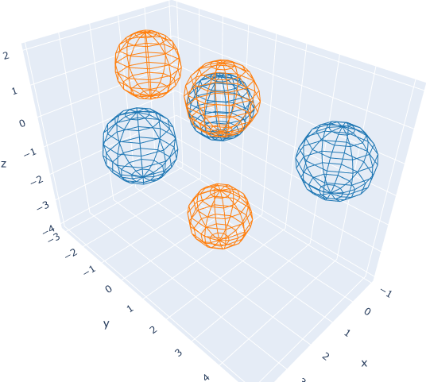

# GaussianMixtureAlignment.jl

A Julia implementation of the Globally-Optimal Gaussian Mixture Alignment (GOGMA) algorithm [(Campbell, 2016)](https://arxiv.org/abs/1603.00150), with modifications inspired by
[Li et. al. (2018)](https://arxiv.org/abs/1812.11307). 

The GOGMA algorithm uses a branch-and-bound procedure to return a globally optimal alignment of point sets via rigid transformation. In order to improve speed for small point sets, the alignment problem can be split to separately optimize rotational and translational alignments, while still guaranteeing global optimality, through the using of translation invariant vectors (TIVs).

Becaues the runtime of the GOGMA algorithm is O(n^2), and that of the TIV-GOGMA algorithm is O(n^4), they may be unsuitable for use with large point sets without downsampling. 

## Construct Isotropic Gaussian Mixture Models (GMMs) for alignment

```julia
julia> # These are very simple point sets that can be perfectly aligned

julia> xpts = [[0.,0.,0.], [3.,0.,0.,], [0.,4.,0.]];

julia> ypts = [[1.,1.,1.], [1.,-2.,1.], [1.,1.,-3.]];

julia> σ = ϕ = 1.;

julia> gmmx = IsotropicGMM([IsotropicGaussian(x, σ, ϕ) for x in xpts])
IsotropicGMM{3, Float64} with 3 IsotropicGaussian{3, Float64} distributions.


julia> gmmy = IsotropicGMM([IsotropicGaussian(y, σ, ϕ) for y in ypts])
IsotropicGMM{3, Float64} with 3 IsotropicGaussian{3, Float64} distributions.


julia> # Compute the overlap between the two GMMs

julia> overlap(gmmx, gmmy)
1.1908057504684806
```

## Align Isotropic GMMs with TIV-GOGMA

```julia
julia> res = tiv_gogma_align(gmmx, gmmy);

julia> # upper and lower bounds of alignmnet objective function at search termination

julia> res.upperbound, res.lowerbound
(-3.2512906351736524, -3.348917632693506)

julia> # rotation component of the best transformation

julia> res.tform.linear
3×3 AngleAxis{Float64} with indices SOneTo(3)×SOneTo(3)(2.0944, -0.57735, 0.57735, -0.57735):
  1.63136e-10   1.90925e-10  1.0
 -1.0           2.24997e-10  1.63136e-10
 -2.24997e-10  -1.0          1.90925e-10

julia> # translation component of the best transformation

julia> res.tform.translation
3-element StaticArrays.SVector{3, Float64} with indices SOneTo(3):
 1.0
 1.0
 1.0

julia> # repeat alignment with stricter tolerance

julia> res.upperbound, res.lowerbound
(-3.2512906351736524, -3.2522904816062654)

julia> # The result has not changed, but there is a tighter lower bound

julia> # Compute the overlap between the GMMs after alignment

julia> overlap(res.tform(gmmx), gmmy)
3.2512906351736524
```

## Plot Isotropic GMMs
```julia
julia> # Draw the unaligned GMMs

julia> plotdrawing(drawIsotropicGMMs([gmmx,gmmy]))
```

```julia
julia> # Draw the aligned GMMs

julia> plotdrawing(drawIsotropicGMMs([res.tform(gmmx),gmmy]))
```

