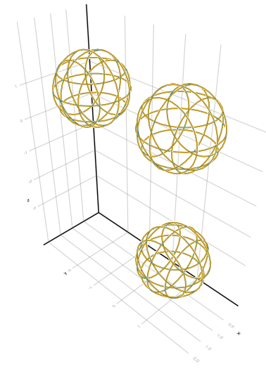
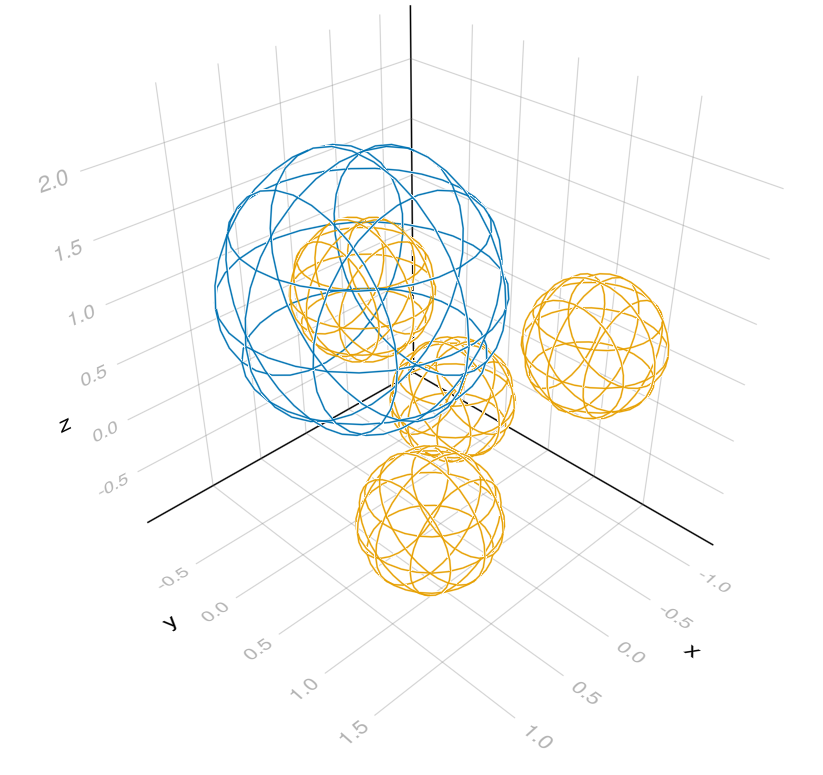
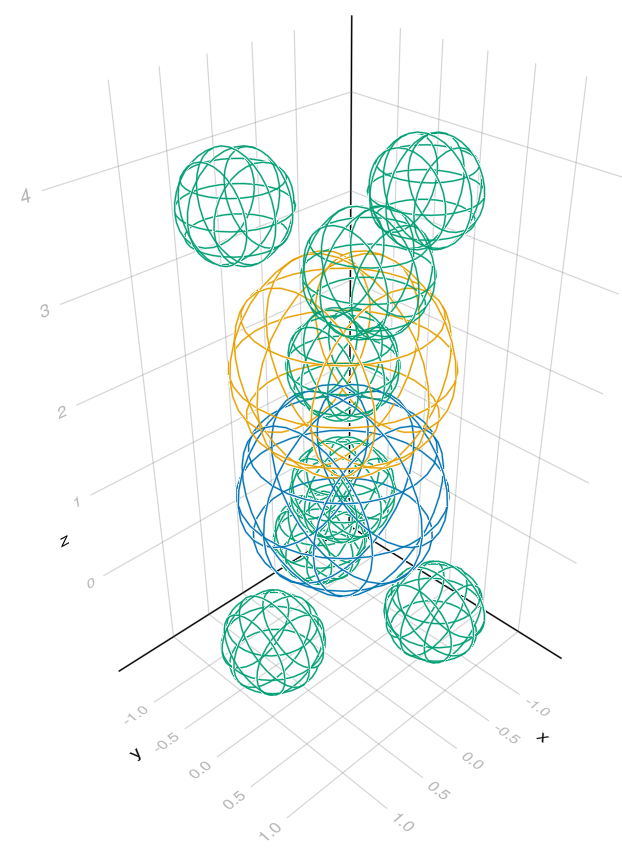

# GaussianMixtureAlignment.jl

A Julia implementation of the Globally-Optimal Gaussian Mixture Alignment (GOGMA) algorithm [(Campbell, 2016)](https://arxiv.org/abs/1603.00150), with modifications inspired by
[Li et. al. (2018)](https://arxiv.org/abs/1812.11307). 

The GOGMA algorithm uses a branch-and-bound procedure to return a globally optimal alignment of point sets via rigid transformation. In order to improve speed for small point sets, the alignment problem can be split to separately optimize rotational and translational alignments, while still guaranteeing global optimality, through the using of translation invariant vectors (TIVs).

Becaues the runtime of the GOGMA algorithm is O(n^2), and that of the TIV-GOGMA algorithm is O(n^4), they may be unsuitable for use with large point sets without downsampling. 

## Construct Isotropic Gaussian Mixture Models (GMMs) for alignment

```julia
julia> using GaussianMixtureAlignment; GMA = GaussianMixtureAlignment;

julia> # These are very simple point sets that can be perfectly aligned

julia> xpts = [[0.,0.,0.], [3.,0.,0.,], [0.,4.,0.]];

julia> ypts = [[1.,1.,1.], [1.,-2.,1.], [1.,1.,-3.]];

julia> σ = ϕ = 1.;

julia> gmmx = IsotropicGMM([IsotropicGaussian(x, σ, ϕ) for x in xpts])
IsotropicGMM{3, Float64} with 3 IsotropicGaussian{3, Float64} distributions.


julia> gmmy = IsotropicGMM([IsotropicGaussian(y, σ, ϕ) for y in ypts])
IsotropicGMM{3, Float64} with 3 IsotropicGaussian{3, Float64} distributions.


julia> # Compute the overlap between the two GMMs

julia> overlap(gmmx, gmmy)
1.1908057504684806
```

## Align Isotropic GMMs with GOGMA

```julia
julia> res = gogma_align(gmmx, gmmy; nextblockfun=GMA.randomblock, maxsplits=10000);

julia> # upper and lower bounds of alignmnet objective function at search termination

julia> res.upperbound, res.lowerbound
(-3.251290635173653, -5.528700740172087)

julia> # rotation component of the best transformation

julia> res.tform.linear
3×3 AngleAxis{Float64} with indices SOneTo(3)×SOneTo(3)(2.0944, -0.57735, 0.57735, -0.57735):
 -1.38948e-11  -2.5226e-11    1.0
 -1.0           9.12343e-11  -1.38948e-11
 -9.12343e-11  -1.0          -2.52261e-11

julia> # translation component of the best transformation

julia> res.tform.translation
3-element StaticArrays.SVector{3, Float64} with indices SOneTo(3):
 1.0000000000115654
 1.000000000557716
 0.9999999997059433

julia> # Compute the overlap between the GMMs after alignment (equal to res.upperbound)

julia> overlap(res.tform(gmmx), gmmy)
3.251290635173653
```

## Plot Isotropic GMMs
```julia
julia> using GLMakie

julia> # Draw the unaligned GMMs

julia> gmmdisplay(gmmx,gmmy)
```


```julia
julia> # Draw the aligned GMMs

julia> gmmdisplay(res.tform(gmmx), gmmy)
```


## Align GMMs with different types of interacting features

```julia
julia> # four points defining a tetrahedron

julia> tetrahedron = [
            [0.,0.,1.],
            [sqrt(8/9), 0., -1/3],
            [-sqrt(2/9),sqrt(2/3),-1/3],
            [-sqrt(2/9),-sqrt(2/3),-1/3]
        ];

julia> # each feature type is given its own IsotropicGMM

julia> chargedGMM = IsotropicGMM([IsotropicGaussian(tetrahedron[1], 1.0, 1.0)]);

julia> stericGMM = IsotropicGMM([IsotropicGaussian(p, 0.5, 1.0) for p in tetrahedron]);

julia> mgmmx = IsotropicMultiGMM(Dict(
           :positive => chargedGMM,
           :steric => stericGMM
       ))
IsotropicMultiGMM{3, Float64, Symbol} with 2 labeled IsotropicGMM{3, Float64} models made up of a total of 5 IsotropicGMM{3, Float64} distributions.

julia> mgmmy = IsotropicMultiGMM(Dict(
           :negative => chargedGMM,
           :steric => stericGMM
       ))
IsotropicMultiGMM{3, Float64, Symbol} with 2 labeled IsotropicGMM{3, Float64} models made up of a total of 5 IsotropicGMM{3, Float64} distributions.

julia> # define interactions between each type of feature

julia> interactions = Dict(
           :positive => Dict(
               :positive => -1.0,
               :negative => 1.0,
           ),
           :negative => Dict(
               :positive => 1.0,
               :negative => -1.0,
           ),
           :steric => Dict(
               :steric => -1.0,
           ),
       );

julia> # apply a random rigid transformation to one of the models

julia> using CoordinateTransformations; randtform = AffineMap((rand(), rand(), rand(), rand(), rand(), rand()));

julia> mgmmx = randtform(mgmmx);

julia> # compute alignment between the two MultiIsotropicGMMs

julia> res = gogma_align(mgmmx, mgmmy; interactions=interactions, nextblockfun=GMA.randomblock, maxsplits=10000);
```
## Plot MultiGMMs

```
julia> # Draw the unaligned GMMs

julia> gmmdisplay(mgmmx)
```


```
julia> gmmdisplay(mgmmy)
```


```julia
julia> # Draw the aligned GMMs. Note that the "steric" features (green) repulse one another.

julia> gmmdisplay(res.tform(mgmmx), mgmmy)
```


## Align GMMs with different types of interacting features